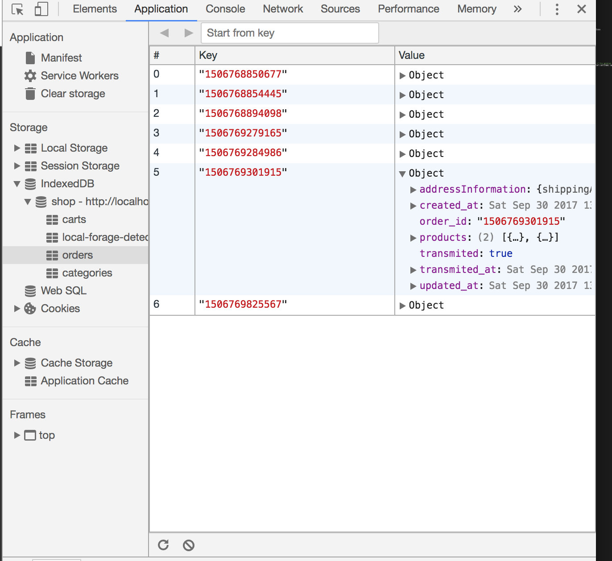
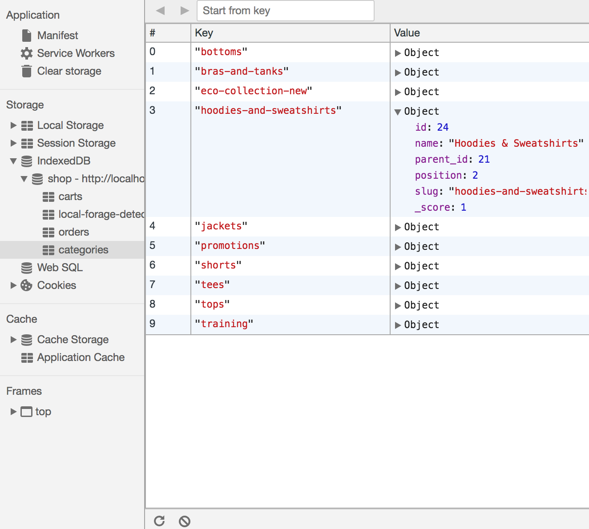

# Introduction 

Vue storefront uses two primary data sources:
1. IndexedDb/WebSQL data store in the browser - using localForage (https://github.com/localForage/localForage)
2. Server data source via vue-storefront-api (https://github.com/DivanteLtd/vue-storefront-api) - which API is compliant with ElasticSearch (regarding product catalog)

## Local data store

You can access localForage repositories thru `Vue.$db` or `global.db` objects anywhere in the code BUT all data-related operations SHOULD be placed in Vuex stores.

Details on localForage API: http://localforage.github.io/localForage/ 

We basicaly have following data stores accesible in the browser (`/src/store/index.js`):

```js
Vue.prototype.$db = {
  ordersCollection: localForage.createInstance({
    name: 'shop',
    storeName: 'orders'
  }),

  categoriesCollection: localForage.createInstance({
    name: 'shop',
    storeName: 'categories'
  }),

  cartsCollection: localForage.createInstance({
    name: 'shop',
    storeName: 'carts'
  })
}

global.db = Vue.prototype.$db // localForage instance
```

Here you have example on how to the Vuex store should be constructed. Please notice the *Ajv data validation*:

```js
import * as types from '../mutation-types'
import { ValidationError } from 'lib/exceptions'
import * as entities from 'lib/entities'
import * as sw from 'lib/sw'
import config from '../../config'
const Ajv = require('ajv') // json validator

// initial state
const state = {
  checkoutQueue: [] // queue of orders to be sent to the server
}

const getters = {
}

// actions
const actions = {

  /**
   * Place order - send it to service worker queue
   * @param {Object} commit method
   * @param {Object} order order data to be send
   */
  placeOrder ({ commit }, order) {
    const ajv = new Ajv()
    const validate = ajv.compile(require('../../models/order_schema.json'))

    if (!validate(order)) { // schema validation of upcoming order
      throw new ValidationError(validate.errors)
    }
    commit(types.CHECKOUT_PLACE_ORDER, order)
  }
}

// mutations
const mutations = {
  /**
   * Add order to sync. queue
   * @param {Object} product data format for products is described in /doc/ElasticSearch data formats.md
   */
  [types.CHECKOUT_PLACE_ORDER] (state, order) {
    const ordersCollection = global.db.ordersCollection
    const orderId = entities.uniqueEntityId(order) // timestamp as a order id is not the best we can do but it's enough
    order.order_id = orderId.toString()
    order.transmited = false
    order.created_at = new Date()
    order.updated_at = new Date()

    ordersCollection.setItem(orderId.toString(), order).catch((reason) => {
      console.debug(reason) // it doesn't work on SSR
    }).then((resp) => {
      sw.postMessage({ config: config, command: types.CHECKOUT_PROCESS_QUEUE }) // process checkout queue
      console.debug('Order placed, orderId = ' + orderId)
    }) // populate cache
  },
  /**
   * Add order to sync. queue
   * @param {Object} queue
   */
  [types.CHECKOUT_LOAD_QUEUE] (state, queue) {
    state.checkoutQueue = queue
    console.debug('Order queue loaded, queue size is: ' + state.checkoutQueue.length)
  }
}

export default {
  namespaced: true,
  state,
  getters,
  actions,
  mutations
}

```

### Orders
`Orders` repository stores all orders transmitted and *to be transmitted* (aka. order queue) used by service worker.


Here you have a validation schema for order: https://github.com/DivanteLtd/vue-storefront/blob/master/src/models/order_schema.json

```json
{
  "order_id": "123456789",
  "created_at": "2017-09-28 12:00:00",
  "updated_at": "2017-09-28 12:00:00",
  "transmited_at": "2017-09-28 12:00:00",
  "transmited": false,
  "products": [{
      "sku": "product_dynamic_1",
      "qty": 1,
      "name": "Product one",
      "price": 19,
      "product_type": "simple"
    },
    {
      "sku": "product_dynamic_2",
      "qty": 1,
      "name": "Product two",
      "price": 54,
      "product_type": "simple"
    }
  ],
  "addressInformation": {
    "shippingAddress": {
      "region": "MH",
      "region_id": 0,
      "country_id": "PL",
      "street": [
        "Street name line no 1",
        "Street name line no 2"
      ],
      "company": "Company name",
      "telephone": "123123123",
      "postcode": "00123",
      "city": "Cityname",
      "firstname": "John ",
      "lastname": "Doe",
      "email": "john@doe.com",
      "region_code": "MH",
      "sameAsBilling": 1
    },
    "billingAddress": {
      "region": "MH",
      "region_id": 0,
      "country_id": "PL",
      "street": [
        "Street name line no 1",
        "Street name line no 2"
      ],
      "company": "abc",
      "telephone": "1111111",
      "postcode": "00123",
      "city": "Mumbai",
      "firstname": "Sameer",
      "lastname": "Sawant",
      "email": "john@doe.com",
      "prefix": "address_",
      "region_code": "MH"
    },
    "shipping_method_code": "flatrate",
    "shipping_carrier_code": "flatrate",
    "payment_method_code": "cashondelivery"
  }
}
```

### Categories
`Categories` is a hash organized by category 'slug' (for example for category with name = 'Example category', slug = 'example-category')


```json

```

### Carts
`Carts` is a store for shopping cart with default key = 'current-cart' representing current shopping cart.
Cart object is an array consit of Products with additional field `quantity` in case when 2+ items are ordered.


```json

```

# Data validation
